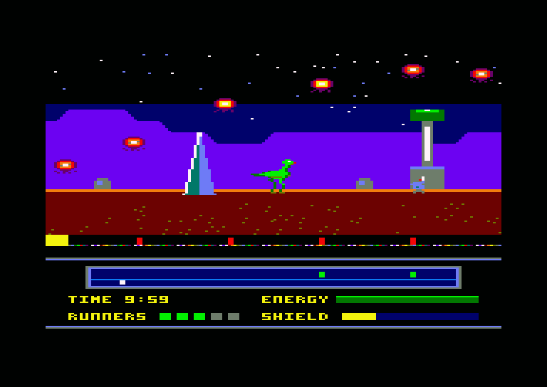

# Shieldrunner (Edgeworld-CPC)

A horizontally scrolling "patrol and recharge" shooter for the Amstrad CPC 6128,
inspired by Palace Software's *Rimrunner* (C64, 1988). You ride a fast mount
around the rim of a dead planet, shoot intruders and dismount to recharge the
shield generators before they fail. The game keeps the original's loop and
adds what reviewers said it lacked: route decisions, risk when you dismount
and a different enemy mix on each planet.

This is an original game. The name, characters, art and music are new, and
nothing from Rimrunner or Palace is reused. The full design and technical plan
is in [plan.md](plan.md).

## Status

| # | Milestone | State |
|---|-----------|-------|
| 1 | Scroll engine: firmware off, Mode 0, double buffer, CRTC hardware scroll over a wrap-around map | **Done** |
| 2 | HUD split and rasters: fixed HUD via CRTC split, raster sky, separate HUD palette | **Done** |
| 3 | Sprite engine: masked, pre-shifted sprites, tile restore, foreground layer; Runner + 8 enemies at 25 fps | **Done** |
| 4 | Player: riding, jumping, shooting, dismount/mount, whistle; compiled sprites in extra RAM | **Done** |
| 5 | Generators and radar: drain, unstable/drained states, breaches, recharge minigame | **Done** |
| 6 | Enemies | Next |
| 7 | First planet complete | |
| 8 | Banking and loading (sprites already load into extra RAM) | |
| 9 | Planets 2-4 | |
| 10 | Release | |

The current build is playable as a toy: ride the Runner around a
1024-pixel test planet, jump, shoot, get off, walk, whistle the Runner over
and climb back on, and keep its four shield generators alive. Each drains at
its own rate; the radar shows them green (stable), flashing (unstable) or
red (drained, letting a breach in), and the core of the one in view does the
same. To recharge one, get off, stand at it and hold down: it charges
slowly, and fire pressed while its core flashes white pumps in a big boost,
but pressed at the wrong time stalls it for a second. The SHIELD gauge in
the HUD shows the charge of the generator in view. Eight drifters swoop
around the view as the enemy load test; they do nothing yet. Everything
holds 25 fps with every frame inside budget.



## Building

You need:

- [RASM](https://github.com/EdouardBERGE/rasm) (tested with 3.2.5)
- [iDSK](https://github.com/cpcsdk/idsk)
- Python 3 with Pillow
- GNU make

```bash
make
```

This generates the test planet, sprite and HUD art, converts them, compiles
the sprites, assembles the game and writes `build/shield.dsk`.

## Running

Load `build/shield.dsk` in a CPC 6128 emulator (Caprice32, WinAPE, ACE-DL) or
on a real machine and type:

```
RUN"SHIELD
```

`SHIELD.BAS` loads the sprites into the 6128's extra 64K, then runs
`GAME.BIN`. A CPC 6128 (or 464 with 64K expansion) is needed.

Controls (joystick, or cursor keys with space to fire):

| Input | Mounted | On foot |
|-------|---------|---------|
| Left / Right | Ride (the Runner speeds up, skids round to turn, coasts to a stop) | Walk (slowly; the screen does not scroll) |
| Up | Jump | Aim up |
| Fire | Shoot forward | Shoot forward |
| Fire + Up | Shoot diagonally up | Shoot straight up, or diagonally with Left / Right |
| Fire + Down | Get off | Get on (standing at the Runner) |
| Down | | Hold at a generator to recharge it; Fire while its core flashes white to pump |
| W | | Whistle: the Runner runs over, or a spare comes in if it is gone |

## Testing

```bash
make test
```

The test boots the disc in a headless CPC 6128 emulator (a Python wrapper
around the [floooh/chips](https://github.com/floooh/chips) CPC emulation,
looked up in `$CPCEMU_DIR`, default `~/cpcemu`). On CRTC types 0, 1 and 2 it
compares the whole 200-line picture of every frame, pixel for pixel, with
what it should be:

- the playfield is the map at the displayed buffer's scroll position with
  that buffer's sprites drawn over it (read from the game's RAM, clipped to
  the view, pen 0 transparent) and the foreground over them, in the
  playfield palette, with the sky pen in the right colour for each raster
  band, so a stale sprite, a missed restore, a wrong clip or a raster change
  that lands inside the picture fails;
- the HUD is in its own palette, with the radar marker where the scroll
  position says;
- the view moves exactly one column every two frames (25 fps), with no late
  buffer flips, scrolls left, right, stops, and wraps past the end of the
  planet;
- frames stay 312 lines long (250 VSYNCs in 5 seconds).

It also reports the least spare time seen in a 25 fps frame.

`tests/test_player.py` drives the player through riding, jumping, shooting
(forward, diagonal, up), getting off, walking to the edge of the view,
whistling, getting back on and calling spare Runners, checking the game's
state after each action and every frame's picture as above.
`tests/test_generators.py` does the same for the generators: drain rates,
unstable flashing on the radar and the core, breaches, and the recharge
minigame (slow charge, a pump in time, a stall, letting go).

Other tools:

- `tests/profile.py` samples the program counter and shows where the time
  goes per routine; `tests/profile.py --work` measures every frame's work
  against the 39,936 us of two frames, riding at full speed and firing
  (currently median 33K, worst 37.6K).
- `tests/calibrate_rasters.py` shows where raster colour changes land in the
  scanline; it was used to tune the delays in `src/system.asm`.

## How it works

**Screen.** Mode 0, 160x200, 16 colours: a 17-row (136-line) scrolling
playfield above an 8-row (64-line) HUD. Each row is 40 CRTC words (80 bytes).

**Scrolling.** Each 2K line block of a 16K screen page is a ring of 1024 CRTC
words. Moving the start address (R12/R13) by one word scrolls the picture by
4 pixels, and only the newly exposed column needs drawing. A scroll position
is a 16-bit column count: its low 10 bits are the CRTC offset and its low 8
bits the map column, so the 256-column planet wraps for free.

**Double buffering.** Two playfield pages at `&C000` and `&8000`. Each buffer
remembers the position it last showed and catches up (two columns per frame
at full speed) before it is displayed again.

**Frame timing.** The firmware is switched off and our own handler runs at
`&0038`. The gate array interrupts 300 times a second, every 52 lines, locked
to VSYNC; counted from the first playfield line they land on lines 242
(during VSYNC), 294, 34, 86, 138 and 190. The main loop never disables
them. When the main loop has queued a
buffer and two frames have passed, the VSYNC interrupt takes its address and
the next interrupt gives it to the CRTC for the coming frame. That locks the
game to 25 fps.

**HUD split.** Each 312-line frame is cut into two CRTC frames: frame A is
the 17 playfield rows, frame B the 8 HUD rows plus border, with VSYNC on its
row 13 so it stays at row 30 overall. The interrupts rewrite R4 (rows in the
frame), R6 (rows shown), R7 (VSYNC row) and R12/R13 (start address) for the
frame to come. Every write is made while the row counter is already past
the value written, so no comparison fires early on any CRTC type, and
R12/R13 are never written on row 0, where CRTC type 1 reloads them. The HUD
lives in page `&4000` and never scrolls. The split works on CRTC types 0, 1
and 2 in the emulator, so the fallback (redrawing the HUD on the scrolling
screen) is not needed.

**Rasters.** The sky is one pen whose colour changes on lines 36 and 88 (three
bands), each change timed with a fixed delay to land in the horizontal
blank, with about 6 us of margin either way. The HUD palette is loaded by
the interrupt on line 138, two lines into the HUD, while the HUD's first
eight lines show only pen 0, so it needs no waiting; the playfield was cut
to 17 rows to make that line fall inside the HUD. The VSYNC interrupt puts
the playfield palette back.

**Sprites.** Software sprites, pre-shifted: each frame is stored as drawn and
shifted one pixel right, so any x is drawn with whole bytes, pen 0
transparent. `tools/spritec.py` compiles every frame into straight-line Z80:
`LD (HL),n` for solid bytes, `AND`/`OR` with immediates for bytes with
transparent pixels, nothing for empty ones, walking each line in whichever
direction is closer so there is no rewind, and stepping to the next line
with a single test for the character row. The code and the raw pixels live
in the 6128's extra RAM banks, paged in at `&4000` while sprites are drawn
(the CRTC keeps showing the HUD from base RAM there). A sprite clipped at the
edge of the view, or one with a line running off the end of the 2K screen
ring (rare), is drawn by a generic masked loop from the raw pixels instead,
with the masks from a 256-byte table. Sprites live in world coordinates.

Each screen buffer keeps the sprites it shows and their cell layout (which
map columns and character rows they cover). Before the buffer is drawn
again, the cells under its old sprites are restored from the map, only on
the lines the sprite covered; there is no saved background. Then the new
sprites are drawn, and the foreground tiles under them are drawn again
through their masks, so sprites pass behind them, as in Pete Green's 1988
routine. While mounted, the Runner and rider are one combined sprite;
frames facing left are mirrored copies.

**Generators.** Generators are 64 columns apart and the view is 40, so only
one is ever on screen: its core is drawn in pen 2, which nothing else uses,
and the game sets that palette entry each frame to show the generator's
state, or the pump pulse while it is being recharged. The radar dots and
the SHIELD gauge are redrawn in the HUD only when they change. Their
positions, drain rates and starting charges are planet data
(`src/planet.asm`).

**Player.** Positions are in eighths of a pixel, so speeds can be
fractional: the Runner accelerates to 4 pixels a frame (the scroll speed)
and the camera moves a column a frame to keep it centred; on foot the
camera stops. Bolts are sprites too (up to 4).

**Frame budget** (riding at full speed and firing, NOPs of 39,936): restore
about 10K, two new scroll columns about 5K, sprite drawing about 4K
(compiled; more when sprites are clipped), interrupts about 2.5K,
foreground up to 3.5K when sprites pass behind it, game logic about 3K.
Median 33K, worst 37.6K: the restore is the next optimisation target, before
the enemies of milestone 6 add their logic.

**Tiles.** A tile is one CRTC character: 4 Mode 0 pixels by 8 lines, 16 bytes.
The map is stored column-major, one byte per cell, with a table of column
start addresses. `tools/png2tiles.py` converts any indexed PNG (pen =
palette index, RGB matched to the nearest CPC colour) into tiles, map and
palette, plus the foreground overlays from a second mask image;
`tools/spritec.py` compiles a sprite sheet; `tools/png2scr.py` converts a
160-pixel-wide PNG into run-length encoded screen layout (used for the HUD).

## Layout

| Path | Contents |
|------|----------|
| `src/main.asm` | Entry point, setup and main loop |
| `src/scroll.asm` | Column drawing, buffer catch-up and flips |
| `src/system.asm` | Interrupt handler: CRTC split, rasters, flips; keyboard and joystick |
| `src/sprites.asm` | Sprite engine: restore, masked drawing, foreground |
| `src/player.asm` | The player: riding, on foot, recharging, bolts, whistle, camera; the sprite list |
| `src/generators.asm` | Shield generators: drain, states, breaches, core colour, radar dots, SHIELD gauge |
| `src/planet.asm` | Planet data: generator positions, drain rates, starting charges |
| `src/demo.asm` | The enemy load test: 8 drifters |
| `src/hud.asm` | HUD setup and radar marker |
| `src/macros.asm` | Shared macros |
| `src/hw.asm` | Hardware ports and constants |
| `tools/gen_testplanet.py` | Generates the test planet image and its foreground mask |
| `tools/gen_sprites.py` | Generates the sprite sheet |
| `tools/gen_hud.py` | Generates the HUD image |
| `tools/gen_tables.py` | Sprite mask table and drifter paths |
| `tools/spritec.py` | Sprite compiler: code and data for the extra RAM banks |
| `tools/mkdisc.py` | Builds the disc: BASIC loader, sprite banks, game |
| `tools/png2tiles.py` | PNG to Mode 0 tiles, map, palette and foreground overlays |
| `tools/png2scr.py` | PNG to run-length encoded Mode 0 screen layout and palette |
| `tools/cpcpal.py` | CPC colours and Mode 0 byte packing |
| `tests/test_screen.py` | Headless frame-by-frame screen test on CRTC types 0, 1 and 2 |
| `tests/calibrate_rasters.py` | Shows where raster changes land in the scanline |
| `tests/test_player.py` | Headless test of every player action |
| `tests/test_generators.py` | Headless test of the generators and the recharge minigame |
| `tests/profile.py` | Sampling profiler and per-frame work measurement |
| `tests/harness.py` | Boots the disc in the headless emulator |
| `assets/` | Source art |

### Memory map (current)

| Range | Use |
|-------|-----|
| `&0038` | Interrupt handler vector |
| `&0040-&01FF` | Stack |
| `&0200-&3FFF` | Code, tables, tiles, map, palettes (about 14K used) |
| `&4000-&7FFF` | HUD screen page (640 bytes of each 2K line block); the rest of block 0 holds start-up and demo data, the other blocks are free |
| `&8000-&BFFF` | Playfield buffer 2 |
| `&C000-&FFFF` | Playfield buffer 1 |

| Extra RAM 4-6 | Sprites: compiled routines and raw pixels (35K) |

The CRTC always reads base RAM, so the HUD stays on screen when one of the
6128's extra banks is paged in at `&4000`.

## Credits

Design inspiration: *Rimrunner* by Steve Brown, Binary Vision, Gary Carr and
Richard Joseph (Palace Software, 1988), and Pete Green's cancelled 1988 CPC
port.
