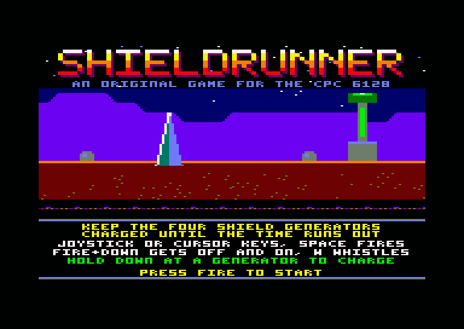
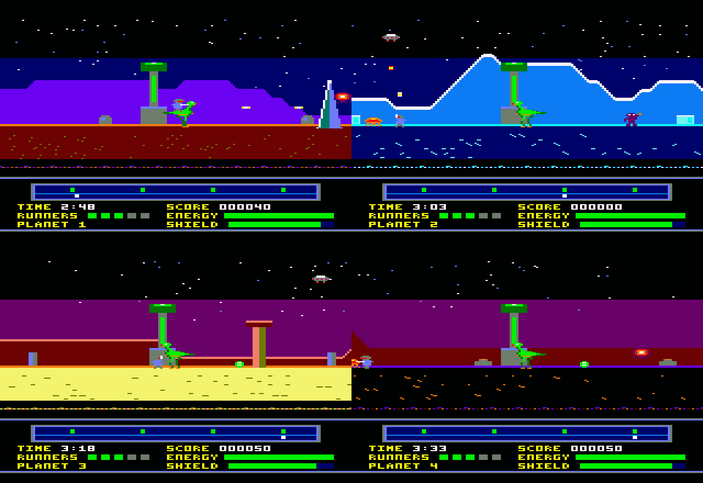

# Shieldrunner (Edgeworld-CPC)

A horizontally scrolling "patrol and recharge" shooter for the Amstrad CPC 6128,
inspired by Palace Software's *Rimrunner* (C64, 1988). You ride a fast mount
around the rim of a dead planet, shoot intruders and dismount to recharge the
shield generators before they fail. The game keeps the original's loop and
adds what reviewers said it lacked: route decisions, risk when you dismount
and a different enemy mix on each planet.

This is an original game. The name, characters, art and music are new, and
nothing from Rimrunner or Palace is reused. The full design and technical plan
is in [plan.md](plan.md).

## Status

| # | Milestone | State |
|---|-----------|-------|
| 1 | Scroll engine: firmware off, Mode 0, double buffer, CRTC hardware scroll over a wrap-around map | **Done** |
| 2 | HUD split and rasters: fixed HUD via CRTC split, raster sky, separate HUD palette | **Done** |
| 3 | Sprite engine: masked, pre-shifted sprites, tile restore, foreground layer; Runner + 8 enemies at 25 fps | **Done** |
| 4 | Player: riding, jumping, shooting, dismount/mount, whistle; compiled sprites in extra RAM | **Done** |
| 5 | Generators and radar: drain, unstable/drained states, breaches, recharge minigame | **Done** |
| 6 | Enemies: drifters, trackers, crawlers, throwers, breach carrier; collisions and energy | **Done** |
| 7 | First planet complete: timer, win/lose, title, high scores, music and sound effects; playtest bots | **Done** |
| 8 | Banking and loading: planets in extra RAM, loaded from disc by the game's own floppy code | **Done** |
| 9 | Planets 2-4: four worlds with their own art, palettes and enemy mixes; difficulty curve | **Done** |
| 10 | Release | Next |

The title screen shows the logo over the first planet, how to play and the
high-score table. You ride the Runner around the 1024-pixel planet, jump,
shoot, get off, walk, whistle the Runner over and climb back on, and you
have **three minutes** (on the first planet) to hold the shield:
keep its four generators charged until the time runs out. Each drains at
its own rate; the radar shows them green (stable), flashing (unstable) or
red (drained, letting a breach in), and the core of the one in view does the
same. To recharge one, get off, stand at it and hold down: it charges
slowly, and fire pressed while its core flashes white pumps in a big boost,
but pressed at the wrong time stalls it for a second.

Enemies come in from the edges of the view: drifters that float at you and
explode on contact, trackers that sweep overhead dropping bombs (they hang
still for a moment after each bomb: shoot straight up), crawlers that walk
the ground (jump them, or shoot them on foot), and throwers that lob rocks
in an arc. When a generator drains, a wave pours out of the breach; with
two drained, the breach carrier arrives, a big ship that takes 12 bolts and
bombs from above. Mounted, hits fall on the Runner: three and it dies,
throwing the rider off. On foot every hit costs energy; one shot enemy in
three leaves an energy cell that gives some back.

The game ends when the rider's energy runs out, when three generators are
drained at once (the shield fails), or when the time runs out with the
shield up: the planet is clear, and the energy left and the generators'
charge make a bonus. A good score goes into the high-score table with your
initials. Music plays on the title and in the game, with jingles for
winning and losing and sound effects on the third channel. Everything
holds 25 fps with every frame inside budget.

Clearing a planet takes you to the next, loaded from disc meanwhile, with
your score and spare Runners and a full energy bar; clearing the fourth
ends the game. Each planet brings its own skyline, ground, props,
foreground, colours, sky, time, generator drain rates and enemy mix:

| # | Planet | Look | Enemies | Time | Drain (per frame, all 4) |
|---|--------|------|---------|------|--------------------------|
| 1 | Ferros, the rust moon | rolling mauve hills, red soil, crystal spires | a bit of everything | 3:00 | 90 |
| 2 | Glacis, the ice world | jagged snow-capped peaks, ice sheet, ice shards | trackers swarm | 3:15 | 96 |
| 3 | Mesa Ra, the desert | flat-topped mesas, sand, rock hoodoos | crawlers and throwers | 3:30 | 104 |
| 4 | Pyre, the volcanic world | smoking cones with lava, black ash, basalt columns | everything, faster | 3:45 | 112 |

Difficulty rises mostly with the drain rates, lower starting charges and
longer timers; enemies come a little faster each planet, never more than
three at once besides breach waves and the carrier.





## Building

You need:

- [RASM](https://github.com/EdouardBERGE/rasm) (tested with 3.2.5)
- [iDSK](https://github.com/cpcsdk/idsk)
- Python 3 with Pillow
- GNU make

```bash
make
```

This generates the planet, sprite, HUD and logo art and the music, converts
them, compiles the sprites, assembles the game and writes `build/shield.dsk`.

## Running

Load `build/shield.dsk` in a CPC 6128 emulator (Caprice32, WinAPE, ACE-DL) or
on a real machine and type:

```
RUN"SHIELD
```

`SHIELD.BAS` loads the sprites and the logo into the 6128's extra 64K, then
runs `GAME.BIN`, which loads the planets itself (`PLANET1.BIN`, ...) as they
are played, so leave the disc in. A CPC 6128 (or 464 with 64K expansion)
is needed. Press fire on the title screen to start.

Controls (joystick, or cursor keys with space to fire):

| Input | Mounted | On foot |
|-------|---------|---------|
| Left / Right | Ride (the Runner speeds up, skids round to turn, coasts to a stop) | Walk (slowly; the screen does not scroll) |
| Up | Jump | Aim up |
| Fire | Shoot forward | Shoot forward |
| Fire + Up | Shoot diagonally up | Shoot straight up, or diagonally with Left / Right |
| Fire + Down | Get off | Get on (standing at the Runner) |
| Down | | Hold at a generator to recharge it; Fire while its core flashes white to pump |
| W | | Whistle: the Runner runs over, or a spare comes in if it is gone |

For the high-score table, up and down choose a letter and fire takes it.

## Testing

```bash
make test
```

The test boots the disc in a headless CPC 6128 emulator (a Python wrapper
around the [floooh/chips](https://github.com/floooh/chips) CPC emulation,
looked up in `$CPCEMU_DIR`, default `~/cpcemu`). On CRTC types 0, 1 and 2 it
compares the whole 200-line picture of every frame, pixel for pixel, with
what it should be:

- the playfield is the map at the displayed buffer's scroll position with
  that buffer's sprites drawn over it (read from the game's RAM, clipped to
  the view, pen 0 transparent) and the foreground over them, in the
  playfield palette, with the sky pen in the right colour for each raster
  band, so a stale sprite, a missed restore, a wrong clip or a raster change
  that lands inside the picture fails;
- the HUD is in its own palette, with the radar marker where the scroll
  position says, and the bars, gauge, Runner icons, time and score as the
  game says it shows them (in the font of `tools/font.py`);
- the view moves exactly one column every two frames (25 fps), with no late
  buffer flips, scrolls left, right, stops, and wraps past the end of the
  planet;
- frames stay 312 lines long (250 VSYNCs in 5 seconds).

It also reports the least spare time seen in a 25 fps frame.

`tests/test_player.py` drives the player through riding, jumping, shooting
(forward, diagonal, up), getting off, walking to the edge of the view,
whistling, getting back on and calling spare Runners, checking the game's
state after each action and every frame's picture as above.
`tests/test_generators.py` does the same for the generators: drain rates,
unstable flashing on the radar and the core, breaches, and the recharge
minigame (slow charge, a pump in time, a stall, letting go).
`tests/test_enemies.py` places enemies straight into the game's slots and
checks shooting them, hits mounted and on foot, jumping a crawler, tracker
bombs killing the Runner, a thrower's rock, energy cells, the breach carrier
and breach waves, the spawner's limits and game over.
`tests/test_game.py` covers the game around them: the title screen and its
music (read back from the AY registers), the high-score page, starting, the
countdown, a sound effect on channel C, clearing the planet (enemies blown
up, the bonus, the message), entering initials and the table's order, a
second game that starts afresh, and the shield failing.
`tests/test_planets.py` checks the planets from disc: bank 7 holding the
first planet's file at boot and its header taken into base RAM, clearing
it into the second (loaded meanwhile, score and Runners kept, its frames
checked pixel for pixel in its own palette), a load with the disc taken
out (the border flashes and it keeps trying until the disc is back),
every planet in play (its own art, tiles and foreground checked pixel for
pixel while riding and firing), and the end of the last planet.

`tests/playtest.py` checks for the "rolling demo" problem, that the game
does not play itself, with bots that play whole games:

| Bot | Plays | Must |
|-----|-------|------|
| idle | touches nothing | lose (energy gone, after about 0:40) |
| gunner | rides laps firing, never recharges, cannot be hurt | lose (shield down at 1:21) |
| keeper | recharges the weakest generator over and over, cannot be hurt | clear the planet (30-37 recharges) |
| player | the keeper firing as it goes, and enemies can hurt it | (reported) |
| skilled | the player, also jumping crawlers and turning to shoot what comes near | (reported) |

`make test` runs the first three on planet 1 and the keeper on every
planet, so each can be held by recharging. The last two measure the
difficulty; `--planet=N` picks the planet and `--seed=N` changes the
enemies. Over six seeds a planet, the skilled bot (which never dodges,
aims carelessly and charges with enemies around: a person does better):

| Planet | Cleared | Otherwise lasted |
|--------|---------|------------------|
| 1 | 2 of 6 | 0:59 to 1:56 of 3:00 |
| 2 | 2 of 6 | 1:17 to 3:10 of 3:15 |
| 3 | 0 of 6 | 1:02 to 2:44 of 3:30 |
| 4 | 0 of 6 | 0:56 to 2:38 of 3:45 (half by the shield failing) |

Tuning that came out of the bots: trackers hang still for a moment after
each bomb so they can be shot from below; throwers walk into the view
before they lob, where they can be seen and shot (they used to stay just
off screen, out of reach of a rider on foot); enemy pressure is planet
data; and the shield fails at three drained generators, so camping at
one generator does not work. They also found a bug: a whistled Runner
coming from some places swung round the rider for ever, never stopping
(`tests/test_player.py` now whistles it from every distance).

Other tools:

- `tests/profile.py` samples the program counter and shows where the time
  goes per routine; `tests/profile.py --work` measures every frame's work
  against the 39,936 us of two frames, riding at full speed and firing
  (currently median 21.8K, worst 26.5K).
- `tests/calibrate_rasters.py` shows where raster colour changes land in the
  scanline; it was used to tune the delays in `src/system.asm`.

## How it works

**Screen.** Mode 0, 160x200, 16 colours: a 17-row (136-line) scrolling
playfield above an 8-row (64-line) HUD. Each row is 40 CRTC words (80 bytes).

**Scrolling.** Each 2K line block of a 16K screen page is a ring of 1024 CRTC
words. Moving the start address (R12/R13) by one word scrolls the picture by
4 pixels, and only the newly exposed column needs drawing. A scroll position
is a 16-bit column count: its low 10 bits are the CRTC offset and its low 8
bits the map column, so the 256-column planet wraps for free.

**Double buffering.** Two playfield pages at `&C000` and `&8000`. Each buffer
remembers the position it last showed and catches up (two columns per frame
at full speed) before it is displayed again.

**Frame timing.** The firmware is switched off and our own handler runs at
`&0038`. The gate array interrupts 300 times a second, every 52 lines, locked
to VSYNC; counted from the first playfield line they land on lines 242
(during VSYNC), 294, 34, 86, 138 and 190. The main loop never disables
them. When the main loop has queued a
buffer and two frames have passed, the VSYNC interrupt takes its address and
the next interrupt gives it to the CRTC for the coming frame. That locks the
game to 25 fps.

**HUD split.** Each 312-line frame is cut into two CRTC frames: frame A is
the 17 playfield rows, frame B the 8 HUD rows plus border, with VSYNC on its
row 13 so it stays at row 30 overall. The interrupts rewrite R4 (rows in the
frame), R6 (rows shown), R7 (VSYNC row) and R12/R13 (start address) for the
frame to come. Every write is made while the row counter is already past
the value written, so no comparison fires early on any CRTC type, and
R12/R13 are never written on row 0, where CRTC type 1 reloads them. The HUD
lives in page `&4000` and never scrolls. The split works on CRTC types 0, 1
and 2 in the emulator, so the fallback (redrawing the HUD on the scrolling
screen) is not needed.

**Rasters.** The sky is one pen whose colour changes on lines 36 and 88 (three
bands), each change timed with a fixed delay to land in the horizontal
blank, with about 6 us of margin either way. The HUD palette is loaded by
the interrupt on line 138, two lines into the HUD, while the HUD's first
eight lines show only pen 0, so it needs no waiting; the playfield was cut
to 17 rows to make that line fall inside the HUD. The VSYNC interrupt puts
the playfield palette back.

**Sprites.** Software sprites, pre-shifted: each frame is stored as drawn and
shifted one pixel right, so any x is drawn with whole bytes, pen 0
transparent. `tools/spritec.py` compiles every frame into straight-line Z80:
`LD (HL),n` for solid bytes, `AND`/`OR` with immediates for bytes with
transparent pixels, nothing for empty ones, walking each line in whichever
direction is closer so there is no rewind, and stepping to the next line
with a single test for the character row. The code and the raw pixels live
in the 6128's extra RAM banks, paged in at `&4000` while sprites are drawn
(the CRTC keeps showing the HUD from base RAM there). A sprite clipped at the
edge of the view, or one with a line running off the end of the 2K screen
ring (rare), is drawn by a generic masked loop from the raw pixels instead,
with the masks from a 256-byte table. Sprites live in world coordinates.

Each screen buffer keeps the sprites it shows and their cell layout (which
map columns and character rows they cover). Before the buffer is drawn
again, the cells under its old sprites are restored from the map, only on
the lines the sprite covered; there is no saved background. Then the new
sprites are drawn, and the foreground tiles under them are drawn again
through their masks, so sprites pass behind them, as in Pete Green's 1988
routine. While mounted, the Runner and rider are one combined sprite;
frames facing left are mirrored copies.

**Generators.** Generators are 64 columns apart and the view is 40, so only
one is ever on screen: its core is drawn in pen 2, which nothing else uses,
and the game sets that palette entry each frame to show the generator's
state, or the pump pulse while it is being recharged. The radar dots and
the SHIELD gauge are redrawn in the HUD only when they change. Their drain
rates and starting charges are planet data; their positions are the same
on every planet (the HUD radar and the core pen rely on them).

**Planets.** `tools/mkplanet.py` packs a planet into a bank image from its
art (converted by `tools/png2tiles.py`) and a description in
`assets/planets/planetN.json` (time, generators, enemy pressure and mix,
colours, sky): at `&4000` the map, at `&5100` a 52-byte header
of the parameters, then the tile address tables, the tile attributes, the
foreground columns, the tiles at `&5600` and the foreground overlays at
`&6600`. The game loads it into extra RAM bank 7 when the planet is played,
and copies the header and the foreground columns into base RAM (the sprite
code reads the latter with a sprite bank paged in). The map, tiles and
overlays are only read with bank 7 paged in, by the column drawing and the
sprite restore and foreground passes.

`tools/gen_planet.py` draws a planet's art from its description, in one of
four styles (rust, ice, desert, volcano: skyline, ground texture, props on
the crust, foreground objects). Skylines keep to the tile grid (heights at
column edges in multiples of 8 lines, steps of at most 8), so a planet
needs 43 to 89 tiles; the generators are drawn alike everywhere.

**Pens.** Sprites share the playfield palette, so it is split
(`tools/pens.py`): pen 0 black, pen 1 the raster sky, pen 2 the generator
core, pens 3-6 the planet's own four colours, and pens 7-15 fixed (bright
white, bright yellow, orange, bright red, grey, bright green, green,
magenta, pastel blue) for the sprites, the generators and anything a
planet wants in those colours. The sprites were redrawn into the nine
fixed pens; `tools/mkplanet.py` refuses a planet whose art changes them.

**Loading from disc.** The firmware is gone once the game runs (the screen
buffers sit over its memory), so `src/disc.asm` drives the uPD765 floppy
controller directly: motor on, recalibrate, read the AMSDOS directory
(track 0, sectors `&C1`-`&C4`), find the file's 1K blocks extent by
extent, read their sectors one command each into the blacked-out screen
pages, then copy the file past its 128-byte AMSDOS header into bank 7.
Interrupts are off meanwhile (a byte comes every 32 us and the transfer
loop takes 24), so the CRTC gets a plain frame with no rows shown and the
sound is silenced; afterwards the interrupt waits for a VSYNC and takes the
split up again. A read that fails (no disc, a bad sector, an overrun)
starts the whole load again with the border flashing red. The loader is
about 600 bytes.

**Player.** Positions are in eighths of a pixel, so speeds can be
fractional: the Runner accelerates to 4 pixels a frame (the scroll speed)
and the camera moves a column a frame to keep it centred; on foot the
camera stops. Bolts are sprites too (up to 4).

**Enemies.** Up to 6 enemies (8 bytes each: type, x, y, hit points,
timer, animation and direction, cell drop) and 4 missiles, updated every
frame through a jump table by type; a type table gives each its frame,
size, hit points, damage and points. Collisions are box overlaps in world
coordinates (x wraps at 1024). The spawner brings one from the planet's
mix every 75 frames while fewer than 3 are about (planet data in
`src/planet.asm`); it also turns the generators' breach flags into waves
and calls the carrier. Enemies far behind the player are dropped. Mounted,
a hit costs the rider 4 energy and the Runner one of its 3 hits; on foot,
8 to 20 depending on the enemy. After a hit the player flickers for 40
frames, untouchable.

**The game around it.** `src/game.asm` starts a game, counts the time down
(a second every 25 game frames), shows the time and score and ends the
game: energy gone, three generators drained at once, or the time out with
the shield up (planet clear: the energy left plus a quarter of the
generators' charge is added as a bonus). The end message goes into the
HUD's text rows one row a frame, so even that frame keeps its time, and the
world goes on behind it for five seconds. `src/title.asm` has the title
screen (the planet at scroll position 0 with the logo masked over its sky,
and a HUD panel that turns between how to play and the high scores), the
five-entry high-score table and the initials entry. Screens are redrawn
behind a blackout: the interrupts load their palettes through pointers
that `screen_off` points at a black palette. Text uses the 3x5 font of
`tools/font.py`, 4 pixels (2 bytes) a character, drawn opaque in one pen.

**Sound.** `src/sound.asm` is a small AY driver ticked at 50 Hz by the
VSYNC interrupt. `tools/gen_music.py` writes the tunes (title, in-game,
and the planet clear and game over jingles) as three note streams each,
with volume-envelope instruments and loops, plus ten sound effects (shot,
jump, explosion, hit, energy cell, whistle, pump, stall, breach alarm, the
last ten seconds' tick) as a volume, period and noise setting per tick. An
effect takes channel C over while it lasts, by priority. The game asks for
music and effects by writing one byte that the next tick picks up, so the
interrupt never sees a half-written request; the registers are written
every tick except while the main code reads the keyboard, which goes
through the same PSG port. It costs about 1.7K NOPs a game frame.

**Frame budget** (riding at full speed and firing, NOPs of 39,936): restore
about 10K, two new scroll columns about 5K, sprite drawing about 4K
(compiled; more when sprites are clipped), interrupts about 2.5K,
foreground up to 3.5K when sprites pass behind it, game logic about 3K,
sound about 1.7K. Measured end to end with `tests/profile.py --work` (flip
to next buffer queued, interrupts included): median 21.8K, worst 26.5K of
39.9K us; the screen test's busiest frame, with the most enemies on
screen, still leaves 11K us spare. The heaviest case is a late planet
with breaches: a breach wave and the carrier on top of the ambient enemies
(6 enemies, missiles, bolts); stress runs on planet 4 left 1.9K to 6.7K
NOPs spare at the worst, with no frame late. The restore stays the main
optimisation target.

**Tiles.** A tile is one CRTC character: 4 Mode 0 pixels by 8 lines, 16 bytes.
The map is stored column-major, one byte per cell, with a table of column
start addresses. `tools/png2tiles.py` converts any indexed PNG (pen =
palette index, RGB matched to the nearest CPC colour) into tiles, map and
palette, plus the foreground overlays from a second mask image;
`tools/spritec.py` compiles a sprite sheet; `tools/png2scr.py` converts a
160-pixel-wide PNG into run-length encoded screen layout (used for the HUD).

## Layout

| Path | Contents |
|------|----------|
| `src/main.asm` | Entry point, setup and main loop |
| `src/scroll.asm` | Column drawing, buffer catch-up and flips |
| `src/system.asm` | Interrupt handler: CRTC split, rasters, flips; keyboard and joystick |
| `src/sprites.asm` | Sprite engine: restore, masked drawing, foreground |
| `src/player.asm` | The player: riding, on foot, recharging, bolts, whistle, camera; the sprite list |
| `src/generators.asm` | Shield generators: drain, states, breaches, core colour, radar dots, SHIELD gauge |
| `src/enemies.asm` | Enemies, missiles, explosions, energy cells; spawner; collisions, hits, ENERGY bar |
| `src/planet.asm` | The planet bank's layout and the current planet's parameters (from its header) |
| `src/disc.asm` | Floppy controller driver: loads planet files into bank 7 |
| `src/game.asm` | Starting and ending a game, the countdown, time and score in the HUD, bonus, end messages |
| `src/title.asm` | Title screen, high-score table, initials entry |
| `src/text.asm` | HUD text: font, centred lines, numbers |
| `src/sound.asm` | AY music and sound effect driver |
| `src/logo.asm` | Draws the title logo from extra RAM |
| `src/hud.asm` | HUD setup and radar marker |
| `src/macros.asm` | Shared macros |
| `src/hw.asm` | Hardware ports and constants |
| `tools/gen_planet.py` | Draws a planet's art and foreground mask from its description, in one of four styles |
| `tools/pens.py` | The playfield pens: fixed ones for sprites, four per planet |
| `tools/gen_sprites.py` | Generates the sprite sheet |
| `tools/gen_hud.py` | Generates the HUD image |
| `tools/gen_logo.py` | Generates the title logo |
| `tools/gen_music.py` | The music and sound effects, as data for `src/sound.asm` |
| `tools/font.py` | The 3x5 font, for the HUD art, the game and the tests |
| `tools/pack_bank.py` | Packs files into an extra RAM bank image (the last sprites and the logo in bank 6) |
| `tools/mkplanet.py` | Packs a planet (art and description) into a bank image |
| `assets/planets/` | The planets' descriptions |
| `tools/gen_tables.py` | Sprite mask table |
| `tools/spritec.py` | Sprite compiler: code and data for the extra RAM banks |
| `tools/mkdisc.py` | Builds the disc: BASIC loader, extra RAM banks, game, planets |
| `tools/png2tiles.py` | PNG to Mode 0 tiles, map, palette and foreground overlays |
| `tools/png2scr.py` | PNG to run-length encoded Mode 0 screen layout and palette |
| `tools/cpcpal.py` | CPC colours and Mode 0 byte packing |
| `tests/test_screen.py` | Headless frame-by-frame screen test on CRTC types 0, 1 and 2 |
| `tests/calibrate_rasters.py` | Shows where raster changes land in the scanline |
| `tests/test_player.py` | Headless test of every player action |
| `tests/test_generators.py` | Headless test of the generators and the recharge minigame |
| `tests/test_enemies.py` | Headless test of enemies, hits, energy and game over |
| `tests/test_game.py` | Headless test of the title, music, countdown, winning, losing and high scores |
| `tests/test_planets.py` | Headless test of loading planets from disc and going from one to the next |
| `tests/playtest.py` | Bots that play whole games: the "rolling demo" check and difficulty |
| `tests/profile.py` | Sampling profiler and per-frame work measurement |
| `tests/harness.py` | Boots the disc in the headless emulator |
| `assets/` | Source art |

### Memory map (current)

| Range | Use |
|-------|-----|
| `&0038` | Interrupt handler vector |
| `&0040-&01FF` | Stack |
| `&0200-&3FFF` | Code, tables, sound driver and music, disc loader, the current planet's header (about 12K used, up to `&322C`) |
| `&4000-&7FFF` | HUD screen page (640 bytes of each 2K line block). The rest of the blocks holds code and data that never page a bank and that the interrupt does not use: block 0 the packed HUD and the text code, block 1 game.asm, block 2 title.asm; blocks 3-7 are free |
| `&8000-&BFFF` | Playfield buffer 2 (and, with buffer 1, where a planet file is read before it goes into bank 7) |
| `&C000-&FFFF` | Playfield buffer 1 |
| Extra RAM 4-6 | Sprites: compiled routines and raw pixels (41K, 45 frames); at `&2800` in bank 6, the title logo (2.3K) |
| Extra RAM 7 | The current planet, loaded from disc: map, header, tiles, foreground (9.7K to 11K) |

The CRTC always reads base RAM, so the HUD stays on screen when one of the
6128's extra banks is paged in at `&4000`.

## Credits

Design inspiration: *Rimrunner* by Steve Brown, Binary Vision, Gary Carr and
Richard Joseph (Palace Software, 1988), and Pete Green's cancelled 1988 CPC
port.
