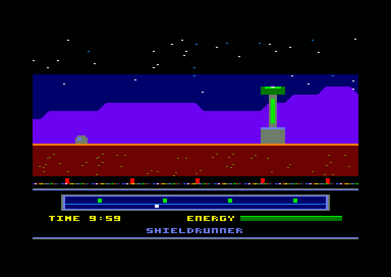

# Shieldrunner (Edgeworld-CPC)

A horizontally scrolling "patrol and recharge" shooter for the Amstrad CPC 6128,
inspired by Palace Software's *Rimrunner* (C64, 1988). You ride a fast mount
around the rim of a dead planet, shoot intruders and dismount to recharge the
shield generators before they fail. The game keeps the original's loop and
adds what reviewers said it lacked: route decisions, risk when you dismount
and a different enemy mix on each planet.

This is an original game. The name, characters, art and music are new, and
nothing from Rimrunner or Palace is reused. The full design and technical plan
is in [plan.md](plan.md).

## Status

| # | Milestone | State |
|---|-----------|-------|
| 1 | Scroll engine: firmware off, Mode 0, double buffer, CRTC hardware scroll over a wrap-around map | **Done** |
| 2 | HUD split and rasters: fixed HUD via CRTC split, raster sky, separate HUD palette | **Done** |
| 3 | Sprite engine | Next |
| 4 | Player | |
| 5 | Generators and radar | |
| 6 | Enemies | |
| 7 | First planet complete | |
| 8 | Banking and loading | |
| 9 | Planets 2-4 | |
| 10 | Release | |

The current build is a screen-engine test: a 1024-pixel test planet
(starfield, mountains, ground, four generators and column markers) scrolls
at 25 fps and wraps seamlessly above a fixed HUD (radar with a live view
marker, timer and energy placeholders). The sky is coloured in three raster
bands and the HUD has its own 16-colour palette.



## Building

You need:

- [RASM](https://github.com/EdouardBERGE/rasm) (tested with 3.2.5)
- [iDSK](https://github.com/cpcsdk/idsk)
- Python 3 with Pillow
- GNU make

```bash
make
```

This generates the test planet and HUD art, converts them, assembles the game
and writes `build/shield.dsk`.

## Running

Load `build/shield.dsk` in a CPC 6128 emulator (Caprice32, WinAPE, ACE-DL) or
on a real machine and type:

```
RUN"SHIELD
```

Controls for the test build (joystick or cursor keys):

| Input | Action |
|-------|--------|
| Left / Right | Scroll left / right (the direction is kept after release) |
| Down | Stop |

It starts scrolling right on its own.

## Testing

```bash
make test
```

The test boots the disc in a headless CPC 6128 emulator (a Python wrapper
around the [floooh/chips](https://github.com/floooh/chips) CPC emulation,
looked up in `$CPCEMU_DIR`, default `~/cpcemu`). On CRTC types 0, 1 and 2 it
compares the whole 200-line picture of every frame, pixel for pixel, with
what it should be:

- the playfield is the map at some scroll position, in the playfield
  palette, with the sky pen in the right colour for each raster band, so a
  raster change that lands inside the picture fails;
- the HUD is in its own palette, with the radar marker where the scroll
  position says;
- the view moves exactly one column every two frames (25 fps), with no late
  buffer flips, scrolls left, right, stops, and wraps past the end of the
  planet;
- frames stay 312 lines long (250 VSYNCs in 5 seconds).

It also reports how much of the 2-frame budget the frame's work used
(currently half).

`tests/calibrate_rasters.py` shows where raster colour changes land in the
scanline; it was used to tune the delays in `src/system.asm`.

## How it works

**Screen.** Mode 0, 160x200, 16 colours: an 18-row (144-line) scrolling
playfield above a 7-row (56-line) HUD. Each row is 40 CRTC words (80 bytes).

**Scrolling.** Each 2K line block of a 16K screen page is a ring of 1024 CRTC
words. Moving the start address (R12/R13) by one word scrolls the picture by
4 pixels, and only the newly exposed column needs drawing. A scroll position
is a 16-bit column count: its low 10 bits are the CRTC offset and its low 8
bits the map column, so the 256-column planet wraps for free.

**Double buffering.** Two playfield pages at `&C000` and `&8000`. Each buffer
remembers the position it last showed and catches up (two columns per frame
at full speed) before it is displayed again.

**Frame timing.** The firmware is switched off and our own handler runs at
`&0038`. The gate array interrupts 300 times a second, every 52 lines, locked
to VSYNC; counted from the first playfield line they land on lines 242
(during VSYNC), 294, 34, 86, 138 and 190. When the main loop has queued a
buffer and two frames have passed, the VSYNC interrupt takes its address and
the next interrupt gives it to the CRTC for the coming frame. That locks the
game to 25 fps.

**HUD split.** Each 312-line frame is cut into two CRTC frames: frame A is
the 18 playfield rows, frame B the 7 HUD rows plus border, with VSYNC on its
row 12 so it stays at row 30 overall. The interrupts rewrite R4 (rows in the
frame), R6 (rows shown), R7 (VSYNC row) and R12/R13 (start address) for the
frame to come. Every write is made while the row counter is already past
the value written, so no comparison fires early on any CRTC type, and
R12/R13 are never written on row 0, where CRTC type 1 reloads them. The HUD
lives in page `&4000` and never scrolls. The split works on CRTC types 0, 1
and 2 in the emulator, so the fallback (redrawing the HUD on the scrolling
screen) is not needed.

**Rasters.** The sky is one pen whose colour changes on lines 36 and 88 (three
bands). The HUD palette is loaded from the end of the last playfield line,
while the HUD's first four lines show only pen 0, and the VSYNC interrupt
puts the playfield palette back. Each change is timed with a fixed delay to
land in the horizontal blank, with about 6 us of margin for the sky changes
and about 40 us for the HUD switch. Interrupts are never disabled in the
main loop, so they arrive on time to within one instruction.

**Tiles.** A tile is one CRTC character: 4 Mode 0 pixels by 8 lines, 16 bytes.
The map is stored column-major, one byte per cell, with a table of column
start addresses. `tools/png2tiles.py` converts any indexed PNG (pen =
palette index, RGB matched to the nearest CPC colour) into tiles, map and
palette; `tools/png2scr.py` converts a 160-pixel-wide PNG into screen layout
(used for the HUD).

## Layout

| Path | Contents |
|------|----------|
| `src/main.asm` | Entry point, setup and main loop |
| `src/scroll.asm` | Column drawing, buffer catch-up and flips |
| `src/system.asm` | Interrupt handler: CRTC split, rasters, flips; keyboard and joystick |
| `src/hud.asm` | HUD setup and radar marker |
| `src/hw.asm` | Hardware ports and constants |
| `tools/gen_testplanet.py` | Generates the test planet image |
| `tools/gen_hud.py` | Generates the HUD image |
| `tools/png2tiles.py` | PNG to Mode 0 tiles, map and palette |
| `tools/png2scr.py` | PNG to Mode 0 screen layout and palette |
| `tools/cpcpal.py` | CPC colours and Mode 0 byte packing |
| `tests/test_screen.py` | Headless frame-by-frame screen test on CRTC types 0, 1 and 2 |
| `tests/calibrate_rasters.py` | Shows where raster changes land in the scanline |
| `tests/harness.py` | Boots the disc in the headless emulator |
| `assets/` | Source art |

### Memory map (current)

| Range | Use |
|-------|-----|
| `&0038` | Interrupt handler vector |
| `&0040-&01FF` | Stack |
| `&0200-` | Code, tiles, map, palettes, HUD image (about 11K) |
| `&4000-&7FFF` | HUD screen page (560 bytes of each 2K line block; the rest is free) |
| `&8000-&BFFF` | Playfield buffer 2 |
| `&C000-&FFFF` | Playfield buffer 1 |

The CRTC always reads base RAM, so the HUD stays on screen when one of the
6128's extra banks is paged in at `&4000`.

## Credits

Design inspiration: *Rimrunner* by Steve Brown, Binary Vision, Gary Carr and
Richard Joseph (Palace Software, 1988), and Pete Green's cancelled 1988 CPC
port.
