# SHIELDRUNNER

### Εγχειρίδιο παίκτη — Amstrad CPC 6128

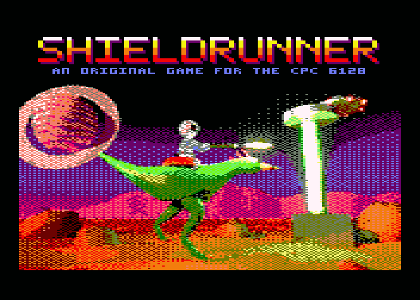

Το Shieldrunner είναι ένα πρωτότυπο παιχνίδι δράσης για τον Amstrad CPC
6128. Καβαλάς τον Runner, ένα μεγάλο μακρυπόδαρο θηρίο, γύρω από τέσσερις
απομακρυσμένους πλανήτες, και κρατάς φορτισμένες τις γεννήτριες της
ασπίδας τους όσο ο εχθρός εισβάλλει.

<div class="pagebreak"></div>

## Περιεχόμενα

1. Η αποστολή
2. Τι χρειάζεσαι και φόρτωση
3. Η οθόνη τίτλου
4. Η οθόνη του παιχνιδιού
5. Χειρισμός
6. Καβάλα στον Runner
7. Πεζός: φόρτιση των γεννητριών
8. Οι γεννήτριες και η ασπίδα
9. Οι εχθροί
10. Ο Runner σου, οι εφεδρικοί και η ενέργεια
11. Οι πλανήτες
12. Παύση και εγκατάλειψη
13. Τέλος πλανήτη, βαθμολογία και ρεκόρ
14. Συμβουλές

## 1. Η αποστολή

Κάθε πλανήτης προστατεύεται από μια ασπίδα, που τη συντηρούν **τέσσερις
γεννήτριες** τοποθετημένες γύρω του. Οι γεννήτριες αδειάζουν συνεχώς, η
καθεμία με τον δικό της ρυθμό. Η δουλειά σου είναι να τις κρατάς
φορτισμένες μέχρι να τελειώσει ο χρόνος του πλανήτη.

- Αν αδειάσουν **τρεις** γεννήτριες ταυτόχρονα, η ασπίδα πέφτει και το
  παιχνίδι τελειώνει.
- Αν τελειώσει η **ενέργειά** σου, πέφτεις και το παιχνίδι τελειώνει.
- Αν αντέξεις μέχρι να τελειώσει ο χρόνος, ο πλανήτης σώθηκε: πας στον
  επόμενο.

Σώσε και τους τέσσερις πλανήτες και κέρδισες.

## 2. Τι χρειάζεσαι και φόρτωση

Χρειάζεσαι έναν **Amstrad CPC 6128**, έναν **6128 Plus** ή οποιονδήποτε CPC
με 64K επιπλέον μνήμη, ή έναν εξομοιωτή όπως ο Caprice32, ο WinAPE ή ο
ACE-DL. Σε CPC με μόνο 64K, ο φορτωτής το λέει και σταματά.

Βάλε τη δισκέτα και γράψε:

```
RUN"SHIELD
```

Πρώτα εμφανίζεται η οθόνη **Revive8bit**. Μένει για 10 δευτερόλεπτα· πάτα
**Space** για να συνεχίσεις αμέσως.

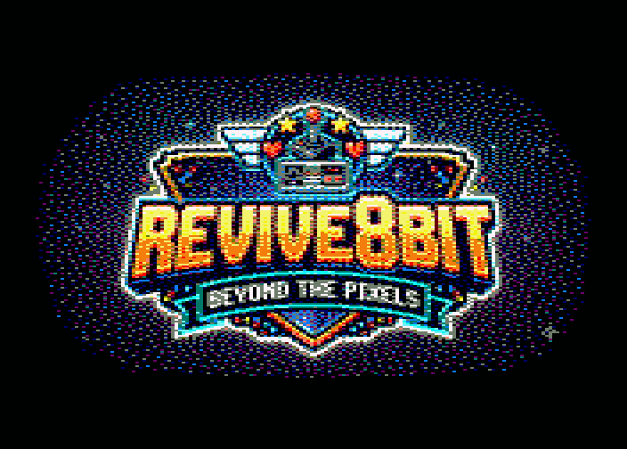

Μετά εμφανίζεται η **οθόνη φόρτωσης** και μένει όσο φορτώνει το παιχνίδι.


**Άφησε τη δισκέτα στον οδηγό.** Κάθε πλανήτης φορτώνεται από αυτή όταν
φτάσεις σε αυτόν.

## 3. Η οθόνη τίτλου

Η οθόνη τίτλου δείχνει τον πρώτο πλανήτη με τον τίτλο πάνω από τον ουρανό
του. Από κάτω εναλλάσσονται κάθε λίγα δευτερόλεπτα δύο σελίδες: μια
υπενθύμιση του πώς παίζεται, και ο **πίνακας με τα ρεκόρ**.

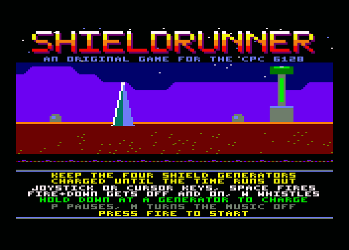

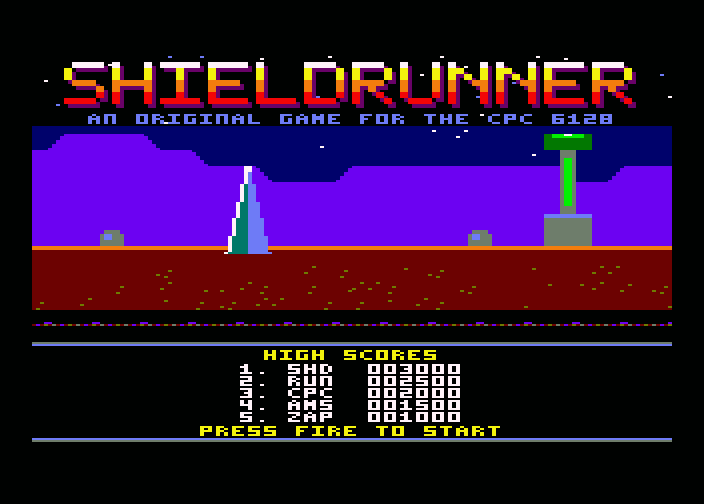

Πάτα **πυρ** για να ξεκινήσεις. Το **M** κλείνει ή ανοίγει τη μουσική, εδώ
και μέσα στο παιχνίδι.

## 4. Η οθόνη του παιχνιδιού

Στο πάνω μέρος είναι το **πεδίο**: η επιφάνεια του πλανήτη, που κυλά καθώς
τρέχεις. Από κάτω είναι ο **πίνακας ενδείξεων**:

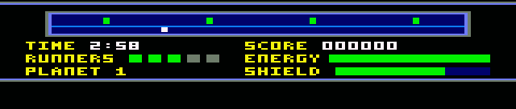

- **Ραντάρ** (η μακριά λωρίδα): ολόκληρος ο πλανήτης, γύρω γύρω. Τα τέσσερα
  τετράγωνα είναι οι γεννήτριες: **πράσινο** κρατά, **αναβοσβήνει**
  ασταθής (πήγαινε σύντομα), **κόκκινο** άδεια. Το λευκό σημάδι είσαι εσύ.
- **TIME:** πόσο ακόμα πρέπει να κρατήσεις την ασπίδα.
- **RUNNERS:** οι εφεδρικοί Runner σου (πράσινα τετράγωνα).
- **PLANET:** σε ποιον πλανήτη είσαι (1 έως 4).
- **SCORE:** η βαθμολογία σου.
- **ENERGY:** η δική σου ενέργεια. Πράσινη, κίτρινη κάτω από τη μισή,
  κόκκινη κάτω από το ένα τέταρτο.
- **SHIELD:** η φόρτιση της πιο κοντινής γεννήτριας, στο χρώμα της
  κατάστασής της.

## 5. Χειρισμός

Παίζεται με **joystick**, ή με τα **βελάκια** και το **Space** για πυρ.

| Πλήκτρο | Καβάλα | Πεζός |
|---------|--------|-------|
| Αριστερά / Δεξιά | Τρέξιμο: ο Runner επιταχύνει, γλιστρά για να στρίψει, σταματά σιγά σιγά | Περπάτημα (η οθόνη δεν κυλά) |
| Πάνω | Άλμα | Σημάδι προς τα πάνω |
| Πυρ | Πυρ μπροστά | Πυρ μπροστά |
| Πυρ + Πάνω | Πυρ λοξά προς τα πάνω | Πυρ κατακόρυφα, ή λοξά με Αριστερά / Δεξιά |
| Πυρ + Κάτω | Κατέβασμα | Ανέβασμα (δίπλα στον Runner) |
| Κάτω (κρατημένο) | | Φόρτιση, δίπλα σε γεννήτρια |
| W | | Σφύριγμα για τον Runner, ή για εφεδρικό |

| Πλήκτρο | |
|---------|--|
| P | Παύση. Ξανά P συνεχίζει· το Esc εγκαταλείπει το παιχνίδι |
| M | Μουσική κλειστή ή ανοιχτή (τα ηχητικά εφέ μένουν) |

## 6. Καβάλα στον Runner

Πάνω στον Runner είσαι γρήγορος: επιταχύνει μέχρι την ταχύτητα που κυλά η
οθόνη, και η εικόνα τον κρατά στη μέση. Για να γυρίσεις, σπρώξε προς την
άλλη μεριά: γλιστρά, κόβει ταχύτητα και γυρίζει. Αν αφήσεις τον μοχλό,
σταματά σιγά σιγά.

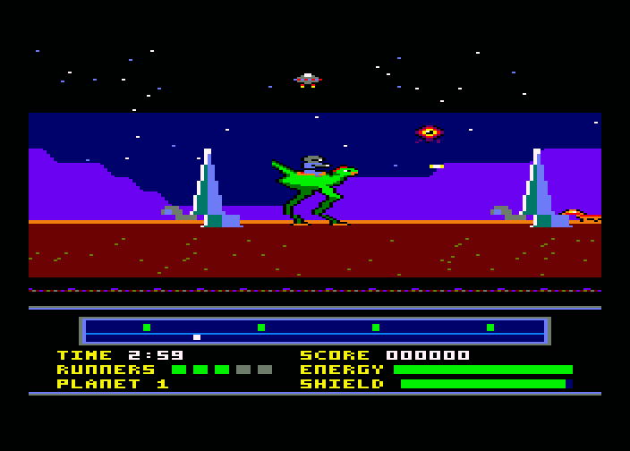

Πάτα **πάνω** για **άλμα**. Με το άλμα περνάς πάνω από τα **crawler**, που
περπατούν στο έδαφος.

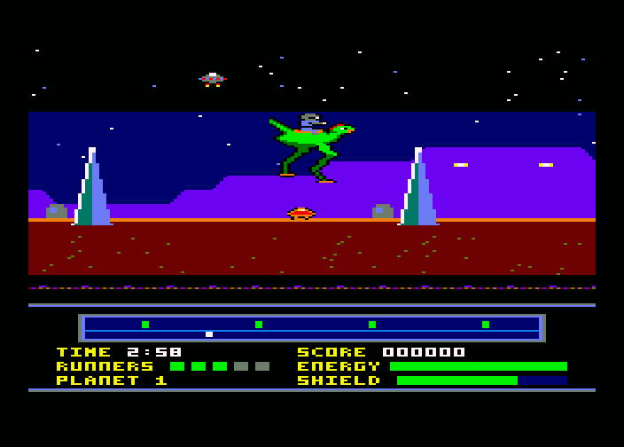

Καβάλα πυροβολείς μπροστά, ή λοξά προς τα πάνω με πυρ και πάνω μαζί.

## 7. Πεζός: φόρτιση των γεννητριών

Οι γεννήτριες φορτίζονται μόνο όταν είσαι πεζός. Πήγαινε στη γεννήτρια,
πάτα **πυρ και κάτω** για να κατέβεις (ο Runner περιμένει εκεί που
στάθηκε), περπάτησε μέχρι τη βάση της γεννήτριας και **κράτα κάτω**. Ο
αναβάτης συνδέεται και η γεννήτρια φορτίζει αργά.

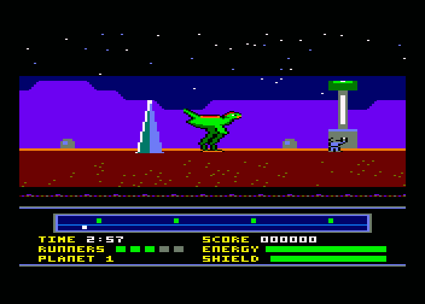

Όσο κρατάς κάτω, ο **πυρήνας** της γεννήτριας **πάλλεται**. Πάτα **πυρ τη
στιγμή που αναβοσβήνει λευκός** για να δώσεις μια μεγάλη ώθηση φόρτισης.
Αν πατήσεις πυρ σε λάθος στιγμή, η φόρτιση **κολλά** για ένα δευτερόλεπτο.
Άφησε το κάτω για να αποσυνδεθείς.

Πεζός, η οθόνη δεν κυλά και περπατάς αργά. Πυρ με πάνω ρίχνει κατακόρυφα,
ή λοξά με αριστερά ή δεξιά. Για να ξανανέβεις, στάσου δίπλα στον Runner
και πάτα **πυρ και κάτω**.

## 8. Οι γεννήτριες και η ασπίδα

Το ραντάρ δείχνει την κατάσταση κάθε γεννήτριας. Μια γεννήτρια που
**αναβοσβήνει** τελειώνει: πήγαινε σε αυτή. Μια **κόκκινη** γεννήτρια
άδειασε: ανοίγει ένα **ρήγμα** και ξεχύνεται από αυτό ένα κύμα εχθρών.

Με **δύο** άδειες γεννήτριες έρχεται το **breach carrier**: ένας μεγάλος
δίσκος που θέλει **δώδεκα βολές** για να πέσει, και σε βομβαρδίζει από
ψηλά. Με **τρεις** άδειες, η ασπίδα πέφτει και το παιχνίδι τελειώνει.

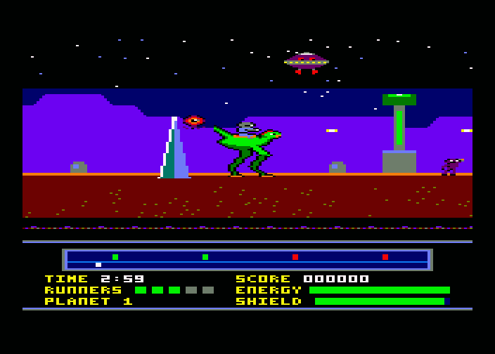

Μια άδεια γεννήτρια μπορεί ακόμα να φορτιστεί: επανέρχεται καθώς τη
φορτίζεις.

## 9. Οι εχθροί

| | Εχθρός | Τι κάνει | Πώς τον νικάς |
|-|--------|----------|---------------|
|  | **Drifter** | Αιωρείται προς το μέρος σου και εκρήγνυται πάνω σου | Χτύπα τον πριν σε φτάσει |
| 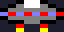 | **Tracker** | Περνά από πάνω σου ρίχνοντας βόμβες | Μετά από κάθε βόμβα μένει ακίνητος για λίγο: ρίξε κατακόρυφα τότε |
|  | **Crawler** | Περπατά στο έδαφος προς το μέρος σου | Πήδα τον όταν είσαι καβάλα· πυροβόλησέ τον όταν είσαι πεζός |
| 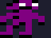 | **Thrower** | Μπαίνει στην οθόνη και πετά πέτρες εκεί που στέκεσαι | Μην μένεις ακίνητος, πήγαινε προς αυτόν και ρίξε |
| 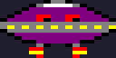 | **Breach carrier** | Έρχεται με δύο άδειες γεννήτριες· βομβαρδίζει από ψηλά | Δώδεκα βολές |
|  | **Κύτταρο ενέργειας** | Το αφήνει μερικές φορές ένας εχθρός που χτυπήθηκε· πέφτει στο έδαφος | Άγγιξέ το και παίρνεις πίσω το ένα τέταρτο της ενέργειάς σου |

## 10. Ο Runner σου, οι εφεδρικοί και η ενέργεια

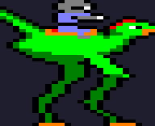 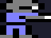

**Καβάλα**, τα χτυπήματα τα δέχεται ο **Runner**. Το καθένα σου κοστίζει
λίγη ενέργεια, αλλά μετά από **τρία χτυπήματα** ο Runner πεθαίνει και σε
ρίχνει κάτω. Μετά από κάθε χτύπημα αναβοσβήνεις για λίγο και δεν μπορεί να
σε ξαναχτυπήσει τίποτα.

**Πεζός**, κάθε χτύπημα σου κοστίζει πολύ περισσότερη ενέργεια, και σε
αποσυνδέει από τη γεννήτρια που φορτίζεις.

Πάτα **W** για να **σφυρίξεις**: ο Runner σου τρέχει κοντά σου και
περιμένει. Αν έχει πεθάνει, μπαίνει ένας **εφεδρικός** από την άκρη της
οθόνης (ξεκινάς με τρεις, φαίνονται στο RUNNERS). Χωρίς εφεδρικούς, δεν
έρχεται κανένας Runner.

Η **ενέργειά** σου είναι γεμάτη στην αρχή κάθε πλανήτη. Τα κύτταρα
ενέργειας σου δίνουν πίσω λίγη.

## 11. Οι πλανήτες


| # | Πλανήτης | Οι εχθροί του | Χρόνος |
|---|----------|---------------|--------|
| 1 | **Ferros**, το σκουριασμένο φεγγάρι | λίγο απ' όλα | 3:00 |
| 2 | **Glacis**, ο παγωμένος κόσμος | σμήνη από tracker | 3:15 |
| 3 | **Mesa Ra**, η έρημος | crawler και thrower | 3:30 |
| 4 | **Pyre**, ο ηφαιστειακός κόσμος | τα πάντα, πιο γρήγορα | 3:45 |

Σε κάθε πλανήτη οι γεννήτριες αδειάζουν πιο γρήγορα και ξεκινούν με
λιγότερη φόρτιση από τον προηγούμενο.

## 12. Παύση και εγκατάλειψη

Πάτα **P** για παύση: η εικόνα σταματά και ο ήχος σβήνει. Ξανά **P**
συνεχίζει· το **Esc** εγκαταλείπει το παιχνίδι.

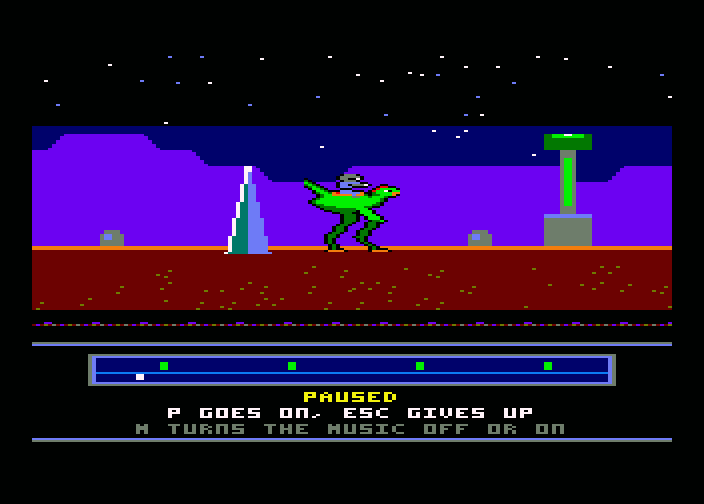

## 13. Τέλος πλανήτη, βαθμολογία και ρεκόρ

Όταν τελειώσει ο χρόνος με την ασπίδα ακόμα ανοιχτή, ο πλανήτης σώθηκε. Η
ενέργεια που σου έμεινε και η φόρτιση των γεννητριών δίνουν ένα **μπόνους**.
Μετά φορτώνει ο επόμενος πλανήτης και συνεχίζεις με τη βαθμολογία σου, τους
εφεδρικούς Runner σου και γεμάτη ενέργεια.

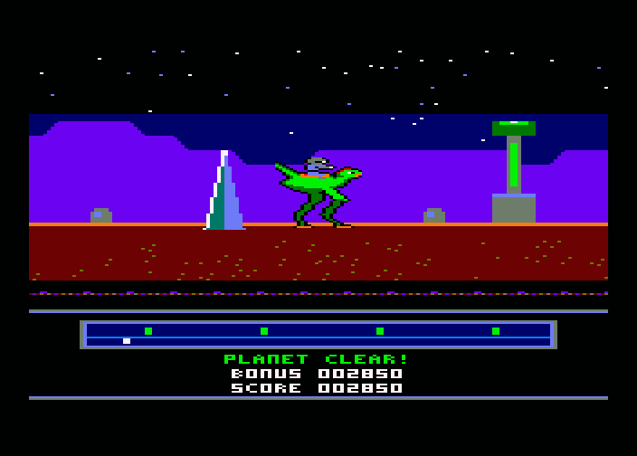

| Κατέρριψες | Πόντοι |
|------------|--------|
| Drifter | 10 |
| Tracker | 20 |
| Crawler | 20 |
| Thrower | 30 |
| Breach carrier | 200 |

Στο τέλος του παιχνιδιού, αν η βαθμολογία σου μπαίνει στον πίνακα, σου
ζητά τα **αρχικά** σου: **πάνω** και **κάτω** διαλέγουν γράμμα, **πυρ** το
κρατά.

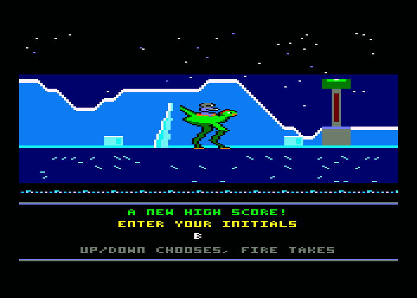

Ο πίνακας με τα ρεκόρ κρατιέται μέχρι να κλείσεις τον υπολογιστή: δεν
αποθηκεύεται στη δισκέτα.

## 14. Συμβουλές

- Πρόσεχε το ραντάρ. Πήγαινε σε μια γεννήτρια που **αναβοσβήνει** πριν
  γίνει κόκκινη.
- Φτάσε καβάλα ως τη γεννήτρια και κατέβα ακριβώς δίπλα της: ο Runner θα
  σε περιμένει εκεί.
- Δώσε ώθηση με **πυρ μόνο στη λευκή λάμψη**. Ένα λάθος πάτημα κοστίζει
  ένα δευτερόλεπτο.
- **Crawler:** πήδα τα όταν είσαι καβάλα. Πεζός, ρίξε τους από μακριά.
- Τα **tracker** μένουν ακίνητα αμέσως μετά τη βόμβα: ρίξε κατακόρυφα τότε.
- Τα **thrower** σταματούν για να πετάξουν πέτρες: πήγαινε προς αυτά και
  ρίξε.
- Μάζευε τα **κύτταρα ενέργειας**. Πέφτουν εκεί που χτυπήθηκε ένας εχθρός.
- Μην αφήνεις να αδειάσουν δύο γεννήτριες: το breach carrier είναι
  δύσκολη δουλειά.

---

*Το Shieldrunner είναι ένα πρωτότυπο παιχνίδι για τον Amstrad CPC 6128,
εμπνευσμένο από το Rimrunner (Palace Software, 1988).*
